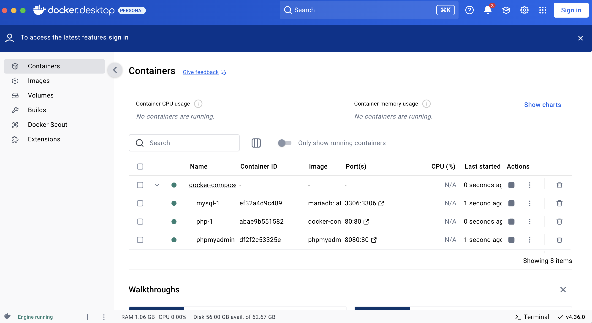
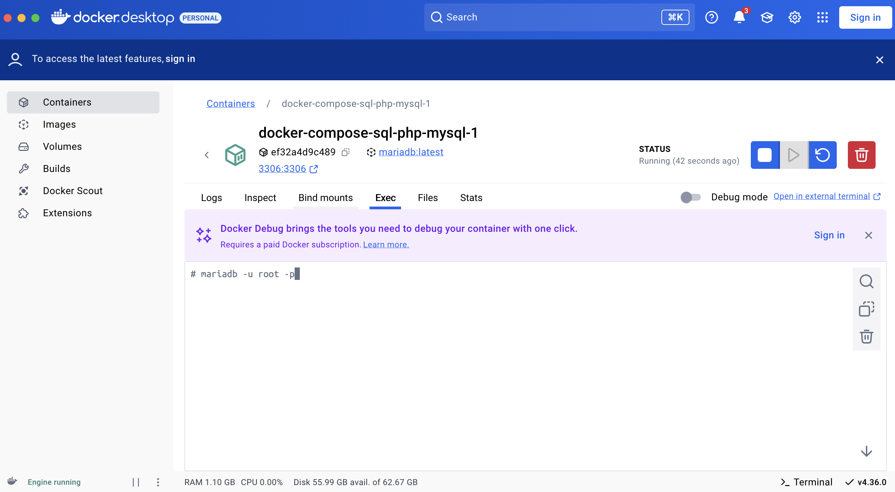

# docker-compose-sql-php

# Docker installeren

De eerste stap is om Docker te installeren. Je kan de site zelf opzoeken of deze link gebruiken: https://docs.docker.com/get-docker/. Volg de instructies op de site en dan moet het goed komen. Waarschijnlijk he je dit al gedaan met het vorige vak SQL/DB

# Download repo

Tweede stap is deze repository downloaden:

`git clone https://github.com/rwarners/docker-compose-sql-php.git`
Dit mag je ook doen via je git client zaols gitKraken,sourceTree of github desktop. Daar is wel ergens een optie te voinden om een niewe (remote) repo te clonen met de URL hierboven genoemd.

(of als clonen echt niet lukt.. download de .zip en pak hem ergens uit: https://github.com/rwarners/docker-compose-sql-php/archive/refs/heads/main.zip)

# Start docker containers (terminal)

Open nu een terminal. De terminal is een manier om commando's van je computer uit te voeren en daarmee programma's te starten. Heel vroeger waren alle computers alleen te gebruiken via een terminal. Voor mac- en linux gebruikers moet het met de naam ‘terminal’ te vinden zijn, voor windows gebruikers moet je zoeken naar de applicatie ‘cmd’.

Ga in je terminal naar de plek waar de reposoitry is gecloned. Gebruik de commando's ‘ls’ of ‘dir’ op windows om te zien waar je bent in je mappenstructuur en ‘cd’ om naar een map te gaan. Net als in html kan je punten(.. <- die dingen) gebruiken om een map omhoog te gaan.

Als je in de map bent waar je moet zijn moet je het volgende commando uitvoeren:

```
docker compose up
```

Het kan zijn dat je Docker compose nog moet installeren als je Linux gebruikt.

Laat het programma zijn ding doen en …. Klaar !
Het hangt een beetje af van welk systeem je gebruikt, maar het kan zijn dat je terminal vastgehouden wordt en je niks meer in mag typen. ALs je de terminal sluit zullen de containers ook stoppen.

Met bovenstaand commando start je nu elke keer de containers.

## Optioneel: containers individueel starten via command line (terminal)

Dit is niet perse nodig, want je kunt met "docker compose up" commando de containers starten als dat nodig is. Maar op deze manier kan je via de command line ook individueel containers starten.

Open een terminal en voer het volgende commando uit:

```
docker ps
```

Dit commando laat alle werkende containers zien. Als het goed is krijg je ongeveer het volgende te zien.

    Als dit niet het geval is probeer dan het commando:
    ```
    docker ps -a
    ```
    Dit commando laat alle containers zien, ook degene die uit staan. Dan moet je ze wel zien.

We kunnen een docker container zelf laten stoppen en starten door de volgende commando’s:

```
docker start container_name
docker stop container_name
```

In het commando moet je container_name nog wel verplaatsen met de naam van de container, in ons geval docker-php-1 en/of docker_mysql_1

# Start docker containers (docker app)

Je kan ook de containers stopen starten en bekijken vie de docker app:


# Contact met de Database server (terminal of docker app)

## Commandos in container kunnen uitvoeren (terminal)

Als je containers werkend zijn gaan we nu verbinding maken met de SQL server. Als eerst moeten we in de terminal van de container zitten. Hiervoor gebruiken we het volgende commando voor:

```
docker exec -it container_naam_van_de_sql_container bash
```

bijvoorbeeld:

```
docker exec -it docker_mysql_1 bash
```

of

```
docker exec -it docker-mysql-1 bash
```

Natuurlijk moeten we ‘container_naam_van_de_sql_container’ nog veranderen naar de juiste naam. Je kan hiervoor het ‘docker ps -a’ commando gebruiken om de naam te achterhalen van de container.

Als je binnen bent merk je dat de linkerkant van je terminal nu een andere naam heeft, als dat zo is dan gaat het goed.

## Commandos in container kunnen uitvoeren (docker app)

Klik op de juiste container van mysql en ga naar het 'exec' tab. Daar kun je nu onderstaande commandos invoeren die in de container worden uitgevoerd.



# Inloggen database (SQL via command line)

Je het volgende commando uitvoeren om in te loggen in de database:

```
mariadb -u root -p
```

Het deel -u root geeft aan dat je wilt inloggen met de username root. Het deel -p geeft aan dat je gevraagd wilt worden om je wachtwoord. Als je gevraagd wordt om je wachtwoord, gebruik dan het wachtwoord password. Als dat niet werkt, moet je in het bestand docker-compose.yml (uit de docker.zip) kijken en zoeken naar root-password.

Als alles goed is gegaan zie je ongeveer dit:

Achter de prompt MariaDB> worden de opdrachten getypt. Zo’n opdracht aan de database noemen we een query. Een query wordt altijd afgesloten met een puntkomma, dus als je een lange query moet schrijven kun je hem met enters verdelen over meerdere regels. De database server gaat pas aan de slag met je query nadat je de puntkomma hebt getypt.

# Inloggen database (via phpMyadmin)

Als de juiste containers zijn gestart, dan kun je in je browser met http://localhost:8080/ phpMyAdmin benaderen

```

```
